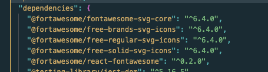

# Fresh Sticky Notes built with React 
 This app is a fun way to learn React hooks, stateful componenets and props, etc.


## Table of contents

- [Overview](#overview)
  - [The challenge](#the-challenge)
  - [Resources](#resouces)
- [My process](#my-process)
  - [What I learned](#what-i-learned)
- [Author](#author)


## Overview

### The challenge
The challenge is to build this app as a greenfield project, use React Hooks, and take the css styling a little further. This app is an update from an app I first built as a lesson from Skillcrush.


### Resouces
- React Images 
    - [Levelup Blog Post](https://levelup.gitconnected.com/display-images-in-react-8ff1f5b1cf9a)
    - [Stack Overflow Post](https://stackoverflow.com/questions/37644265/correct-path-for-img-on-react-js)

## My process
- started with mapping out which components would be container components and presentational components based on what the app should do and where the user data would flow.
- designed the app in Figma [Fresh Sticky Notes](https://www.figma.com/embed?embed_host=share&url=https%3A%2F%2Fwww.figma.com%2Ffile%2FrOMYTzRhT9IsdPX5sqAYqf%2FFresh-Sticky-Notes-React-Project%3Fnode-id%3D0%253A1%26t%3DCbzTznrTPD52l6Ca-1)


- built out all the JSX in the App.js file first
- considered using Bootstrap for React since I just did a tutorial but after an initial start decided this was more trouble than it was worth for this project
- Had issues with using ``` <picture> ``` element in the JSX so switched to using just an ```  ``` element. Even then I stuggled to get the image file's path correct. I tried importing and naming the image and then using ``` src={image} ``` but this didn't work. Ended up putting the images in the Public folder instead of the src folder. Still not sure how happy I am with my choice but it worked 😊
- 

### Fontawsome for React
installed font awesome's SVG core package
``` npm i --save @fortawesome/fontawesome-svg-core ```
installed the free versions of icons
``` npm i --save @fortawesome/free-solid-svg-icons 
npm i --save @fortawesome/free-regular-svg-icons
npm i --save @fortawesome/free-brands-svg-icons 
```
installed font awesome React component
``` npm i --save @fortawesome/react-fontawesome@latest ```

checked the package.json file and saw five new dependencies


imported individual icons as opposed to dynamic or global imports
``` import { faEnvelope } from '@fortawesome/free-solid-svg-icons';
import { faGithub, faLinkedin } from '@fortawesome/free-brands-svg-icons' 
```
and the used this format for JSX 
``` <div className="footer-icons">
            <FontAwesomeIcon icon={faEnvelope} />
            <FontAwesomeIcon icon={faGithub} />
            <FontAwesomeIcon icon={faLinkedin} />
        </div>
```
** Warning! The fontawesome website gives all individual icon components with camelCase but it doesn't work in React when importing or calling icons. So faGitHub is what is in documentation for v6.4.0 but faGithub is what actually works. Not sure if this is an issue of different versions of fontawesome but seeing as I followed their directions and installed the lastest version of fontawesome ```@fortawesome/react-fontawesome@latest ``` I am not sure.


### What I learned


## Author

- Website - [Amy Spencer](https://spencerproject.com/)
- Frontend Mentor - [@amyspencerproject](https://www.frontendmentor.io/profile/amyspencerproject)
- Linkedin - [amyspencercodes](https://www.linkedin.com/in/amyspencercodes/)